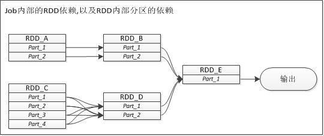

# Spark shuffle研究
版本：1.1.0

不管是hadoop中map/reduce还是spark中各种算子，shuffle过程都是其中核心过程，shuffle的设计是否高效，基本确定了整个计算过程是否高效。
设计难点在于shuffle过程涉及到大数据的IO操作（包括本地临时文件IO和网络IO），以及可能存在的cpu密集型排序计算操作。  

刚刚发布的spark1.1版本，spark针对大型数据引入一个新的shuffle实现，即“sort-based shuffle”
> This release introduces a new shuffle implementation optimized for very large scale shuffles. 
> This “sort-based shuffle” will be become the default in the next release, and is now available to users. 
> For jobs with large numbers of reducers, we recommend turning this on. 

本文针对shuffle相关的代码逻辑做一次串读，其中包括shuffle的原理，以及shuffle代码级别的实现。

## Job，Stage，Task, Dependency

在Spark中，RDD是操作对象的单位，其中操作可以分为转换(transformation)和动作(actions),只有动作操作才会触发一个spark计算操作。  
以rdd.map操作和rdd.count操作做比较  

    def map[U: ClassTag](f: T => U): RDD[U] = new MappedRDD(this, sc.clean(f))
    def count(): Long = sc.runJob(this, Utils.getIteratorSize _).sum   

map是一个转换操作，它只是在当前的rdd的基础上创建一个MappedRDD对象，而count是一个动作操作，它会调用sc.runJob向spark提交一个Job  

Job是一组rdd的转换以及最后动作的操作集合，它是Spark里面计算最大最虚的概念，甚至在spark的任务页面中都无法看到job这个单位。
但是不管怎么样，在spark用户的角度，job是我们计算目标的单位，每次在一个rdd上做动作操作时，都会触发一个job，完成计算并返回我们想要的数据。  

Job是由一组RDD上转换和动作组成，这组RDD之间的转换关系表现为一个有向无环图(DAG)，每个RDD的生成依赖于前面1个或多个RDD。  
在Spark中，两个RDD之间的依赖关系是Spark的核心。站在RDD的角度，两者依赖表现为点对点依赖，但是在Spark中，RDD存在分区（partition）的概念，两个RDD之间的转换会被细化为两个RDD分区之间的转换。

如上图所示，站在job角度，RDD_B由RDD_A转换而成，RDD_D由RDD_C转换而成，最后RDD_E由RDD_B和RDD_D转换，最后输出RDD_E上做了一个动作，将结果输出。
但是细化到RDD内分区之间依赖，RDD_B对RDD_A的依赖，RDD_D对RDD_C的依赖是不一样，专业的说法为窄依赖和宽依赖。

所谓的窄依赖是说子RDD中的每一个数据分区只依赖于父RDD中的对应的有限个固定的数据分区，而宽依赖是指子RDD中的每个数据分区依赖于父RDD中的所有数据分区。
宽依赖很好理解，但是对于窄依赖比较绕口，特别是定义中有限与固定两个要求，宽依赖也满足有限和固定这两个要求？难道他们俩个之间区别也仅仅在于“有限”这个数字的大小？
其实就是这样的理解，“有限”就表现为所依赖的分区数目相比完整分区数相差很大，而且spark靠窄依赖来转换而来的RDD都表现为一对一的依赖，所以就不需要纠结这个有限的关键字。
这里还有一个问题，count操作是依赖父RDD的所有分区进行计算而得到，那么它是宽依赖吗？这么疑问，答案肯定就是不了，首先依赖是RDD之间的关系描述，count操作只有输出，
没有子rdd的概念。看上面的实现，count只是把sc.runJob计算返回的Array[U]做一次sum操作而已。

窄依赖和宽依赖的分类是Spark中很重要的特性，不同依赖在实现，任务调度机制，容错恢复上都有不同的机制。

+实现上：对于窄依赖，rdd之间的转换可以直接pipe化，而宽依赖需要采用shuffle过程来实现。
+任务调度上：窄依赖意味着可以在某一个计算节点上直接通过父RDD的某几块数据（通常是一块）计算得到子RDD某一块的数据；而相对的，宽依赖意味着子RDD某一块数据的计算必须等到它的父RDD所有数据都计算完成之后才可以进行，而且需要对父RDD的计算结果进行hash并传递到对应的节点之上。
+容错恢复上：窄依赖的错误恢复会比宽依赖的错误恢复要快很多，因为对于窄依赖来说，只有丢失的那一块数据需要被重新计算，而宽依赖意味着所有的祖先RDD中所有的数据块都需要被重新计算一遍，这也是我们建议在长“血统”链条特别是有宽依赖的时候，需要在适当的时机设置一个数据检查点以避免过长的容错恢复。

