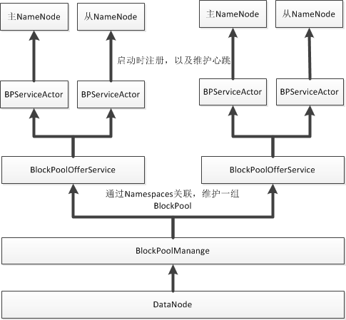

# DataNode分析

HDFS分为DataNode和NameNode，其中NameNode提供了Meta信息的维护，而DataNode提供了真实文件块的存储和读写；NameNode是在内存中维护整个文件树，很吃内存，但是在NameNode内存充足的时候，基本上NameNode不会成为性能的瓶颈，反而DataNode，它提供了真实Block的读写，整体HDFS性能是否满足需求，就要看DataNode了。

## DataNode向NameNode提供Block存储“管理”功能
Namespaces和BlockPool是NameNode和DataNode管理文件目录树/Block的单位；每个NameNode都属于一个Namespace，它维护了该文件系统上的文件目录树，其中目录的信息只需要维护在NameNode上，而文件Block信息与读写操作需要DataNode参与，即每一个NameNode上的Namespace在DataNode上都对应一个BlockPool；

对于一个HDFS集群cluster来说，传统只有一组namenode（这里的一组指的是HA，但是任何时间都只有一个NameNode提供服务）维护一个Namespace和一组datanode，每个datanode都维护一个BlockPool；但是在现在支持Federation功能的集群上，一个cluster是可以包含多组namenode，每组namenode独立维护一个Namespace，但是datanode不是独立的，此时每个datanode需要针对每个Namespace都维护一个BlockPool；

DataNode通过BlockPool给NameNode提供了Block管理的功能，但是NameNode从不主动的去请求DataNode去做何种动作，而是DataNode针对每个BlockPool都维护一个与自己归属的NameNode之间心跳线程，定期的向NameNode汇报自身的状态，在NameNode返回的心跳值中会携带相关的Command命令信息，从而完成NameNode对DataNode控制。

在DataNode中，对一组BlockPool的管理是通过BlockPoolManager这个类来提供的，在DataNode启动时，会初始化一个该对象，并从配置中读取该datanode需要服务的BlockPool，并针对每个BlockPool初始化一个BPOfferService，并与相应的NameNode完成注册以及心跳的维护。

     //DataNode中的逻辑
     blockPoolManager = new BlockPoolManager(this);
     //从配置中读取datanode需要服务的BlockPool
     blockPoolManager.refreshNamenodes(conf);
     //BlockPoolManager中的逻辑
     for (String nsToAdd : toAdd) {
          ArrayList<InetSocketAddress> addrs =
            Lists.newArrayList(addrMap.get(nsToAdd).values());
          BPOfferService bpos = new BPOfferService(nnAddrs, dn);
          bpByNameserviceId.put(nsToAdd, bpos);
          offerServices.add(bpos);
    }
    
对于支持HA的环境下，每一个NameSpace是有一组而不是一个NameNode，单个Active，多个Standby，那么问题来了？DataNode是只需要和Active注册，交互吗？不，对于每一个BPOfferService，它会与该组的每一个NameNode都维护一个连接以及心跳，其中每个连接表示一个BPServiceActor对象。但是在心跳协议的工作过程中，BPOfferService是不会响应来自Standby NameNode的任何命令信息。

    //BPOfferService中的逻辑
    for (InetSocketAddress addr : nnAddrs) {
      this.bpServices.add(new BPServiceActor(addr, this));
    }
    private BPServiceActor bpServiceToActive = null;//当前处于Active的BPServiceActor
   
  对于具体BPServiceActor与NameNode之间的交互包括哪些功能呢？

- 两次握手：在BPServiceActor初始化过程中，需要与NameNode建立起连接，并完成两次握手；第一次握手是获取NameNode的namespace信息（NamespaceInfo），并针对NameNode的版本进行验证；第二次握手是向NameNode进行register注册，获取注册以后的信息（DatanodeRegistration）；
- 心跳协议：BPServiceActor会定期与NameNode维持一个心跳协议；心跳信息除了维持一个节点存在性以外，还会在心跳信息中带上当前BlockPool每一个Volumn的StorageReport，容量信息和有问题的Volume，注意这些都只是信息；
- blockReport：定期心跳只会上报基本容量等信息，而是否上报DataNode存储的Block信息需要根据心跳的返回值来确定（是否设置了fullBlockReportLeaseId）；此时BPServiceActor通过Dataset().getBlockReports获取当前BlockPool的Block列表，并完成汇报。
- cacheReport：汇报当前的BlockPool的Dataset().getCacheReport的信息
- reportReceivedDeletedBlocks：向NameNode汇报已经响应删除的Block列表
- reportBadBlocks：汇报有问题的block，在进行block扫描过程中，如果发现block的文件不存在就为有问题的block；（在上传的过程中，如果client没有正常关闭，此时datanode也会有一个处理坏掉block的过程，即reportRemoteBadBlock）

NameNode对BPServiceActor的操作是通过心跳协议来返回的，其中主要的操作包括：
- DNA_TRANSFER: Block的复制，将本地的一个Block复制（transferBlocks）到目标DataNode
- DNA_INVALIDATE：回收删除Block
- DNA_CACHE：将一组Block进行Cache
- DNA_UNCACHE：将一组Block从Cache中删除
- DNA_SHUTDOWN：关闭DataNode
- DNA_FINALIZE：将当前的BlockPool置为finalize状态
- DNA_RECOVERBLOCK：恢复一个Block，@todo后面会详细的分析Block的恢复

上面就是DataNode向NameNode提供Block存储“管理”功能

## DataNode提供对Replica副本操作的封装
在上面小结中，我们分析了DataNode可以为NameNode提供哪些Block管理功能，但是这些都仅是Block信息（BlockInfo）和Pool信息的交互而已，而对具体Block对应的磁盘文件的管理是通过FsDataset这个对象来提供的。

另外，在HDFS上，虽然Block是贯穿在整个系统中，但是在DataNode上，用Replica副本这个概念来解释可能更好点。何为副本？在HDFS上，每一个Block都有单副本或者多副本，这些副本分布在所有DataNode上，由NameNode来维护它的存在，而DataNode来提供副本的存储和读写。

FsDataset对象功能分为两个粒度，分别为对Pool和Replica的管理。
- Pool层面的管理DataStorage：如上描述，针对每个BlockPool，DataNode都是独立维护一个Pool管理对象BlockPoolSliceStorage，比如DataNode第一次初始化时候，需要针对每个Pool创造pool根目录，DataNode的升级也需要BlockPoolSliceStorage的支持；
- Replica层面的管理FsVolume：在HDFS的配置中，“dfs.datanode.data.dir”可以指定多个Volume目录，每一个目录就对应这里的一个FsVolume对象，在每一个FsVolume对象内部，针对每个BlockPool都创建一个目录和一个对象对Pool上的Replica文件进行物理层面上的管理，这里对象即为BlockPoolSlice；比如BlockPoolSlice.createRbwFile函数可以在磁盘上指定pool的目录下面创建相应的Block文件；DataNode对Pool磁盘空间的管理，比如一个Pool在磁盘使用多少空间，也是通过BlockPoolSlice.getDfsUsed获取每个pool当前占用的磁盘空间，然后进行求和来获取的。

DataNode上每个Block都是落地在磁盘上，可以通过blockid快速定位到磁盘路径（DatanodeUtil.idToBlockDir），每一个Block在物理上由Meta和Data两个文件组成，其中Meta中存储了Block的版本，crc32，id，大小，生成时间等信息，从原则上来说，好像是可以不需要在内存中缓存DataNode上存储的Block文件列表，对于Block的操作可以逐步的根据BlockPoll和Blockid定位到磁盘上的文件，但是偏偏在DataNode上维护了一个大Map（ReplicaMap）存储了当前DataNode处理的副本（Map<Blockpool, LightWeightResizableGSet<Block, ReplicaInfo>> map）。不懂！！而且需要消耗一个线程DirectoryScanner定期将ReplicaMap中的信息与磁盘中文件进行check（FsDatasetImpl.checkAndUpdate）。

针对整个DataNode上每个Volumn目录，都有一个VolumeScanner对象，并由BlockScanner进行集中管理，它们负责对磁盘上存储的副本进行校验(校验的方式和读文件时候逻辑一直，只是把读的文件写到/dev/null中)，在写失败的过程中也会针对写失败的文件标记为markSuspectBlock，优先进行扫描，如果扫描过程中发现有问题的Block，会调用datanode.reportBadBlocks向NameNode标记坏掉的Block。

fsDataset对磁盘上的Block文件的删除是采用异步线程来处理的即FsDatasetAsyncDiskService，从而不会因为大的Block删除阻塞DataNode的逻辑

## DataNode提供Client文件读写的功能
在整个HDFS文件操作过程中，DataNode提供了文件内容的最终读写的能力，在DataNode中，整个数据的流动由DataXceiverServer服务来承担，它是基于Peer的通信机制，差不多是唯一一个不基于IPC通信的通信模块。

在DataXceiverServer的启动时，会初始化一个peerServer，并循环阻塞在peerServer.accept()上，接受每一个Client的连接。在HDFS中，数据的读写是采用pipeline机制，所有Client可能是客户端，也可能是另外一个DataNode，同时在数据balancer过程中，Client也可能是DataNode，这也是peer的含义，即对等通信，DataNode之间互为Server和Client。关于Peer的细节这里就不分析了，比较简单，在日常的运维的过程中，只需要关注peer连接数是否达到上限（默认是4096，很大了！），peer之间读写是否超时就可以。

DataXceiverServer是一个PeerServer容器，每一个与当前DataNode的连接都会创建Peer，并被DataXceiverServer封装为一个DataXceiver实例，该实例实现了DataTransferProtocol接口，由它来处理peer之间的交互逻辑，其中主要包括下面三个功能：

	public interface DataTransferProtocol {
		void readBlock(final ExtendedBlock blk,final long blockOffset,....)
		void writeBlock(final ExtendedBlock blk,DatanodeInfo[] targets,....)
		void transferBlock(final ExtendedBlock blk,final DatanodeInfo[] targets,...)
		...
	}

读比较好理解，写和balancer的操作中有一个DatanodeInfo[] targets参数，它即为DataNode写文件的Pipeline特性，即当前DataNode写完以后，需要将Block写到targets目标DataNode。

Peer之间连接是保持Keepalive，默认超时时间是4000ms，同时连接是是双向的，有Input/OutputStream两个流，那么对于一个Peer，是怎么确定这个Peer的功能呢？是读还是写？在DataXceiver内部是通过一个op的概念来标识的。每次一个流的第一个字节来表标识这个流的功能。目前包括：

	public enum Op {
	  WRITE_BLOCK((byte)80),
	  READ_BLOCK((byte)81),
	  READ_METADATA((byte)82),
	  REPLACE_BLOCK((byte)83),
	  COPY_BLOCK((byte)84),
	  BLOCK_CHECKSUM((byte)85),
	  TRANSFER_BLOCK((byte)86),
	  REQUEST_SHORT_CIRCUIT_FDS((byte)87),
	  RELEASE_SHORT_CIRCUIT_FDS((byte)88),
	  REQUEST_SHORT_CIRCUIT_SHM((byte)89),
	  CUSTOM((byte)127);
	}
在DataXceiver.readOp()内部来获取流的功能，并在DataXceiver.processOp(op)中，针对不同的流进行switch匹配和处理。下面我们会针对两个重要的流READ_BLOCK/WRITE_BLOCK进行分析。

### READ_BLOCK
对于READ操作，InputStream在Op字节后有一个序列化的OpReadBlockProto，表示这次读操作的相关参数，其中包括以下参数：

	message OpReadBlockProto {
	  message ClientOperationHeaderProto {
		  message BaseHeaderProto {
			  required ExtendedBlockProto block = 1;//操作的Block
			  optional hadoop.common.TokenProto token = 2;
			  optional DataTransferTraceInfoProto traceInfo = 3;
		  }
		  required string clientName = 2;//客户端唯一标识
	  }
	  required uint64 offset = 2;//对应Block的偏移量
	  required uint64 len = 3;//读取的长度
	  optional bool sendChecksums = 4 [default = true];
	  optional CachingStrategyProto cachingStrategy = 5;
	}

其中核心参数就是block+offset+len，它指定需要读取的block的id，偏移量与大小。

ReadBlock主要包括以下几个步骤：
- DataXceiver首先会向Client发送一个READ操作响应流，其中响应了这次操作结果Status=SUCCESS以及后面发送数据的checksum。
- 随后DataXceiver调用BlockSender将该Block的数据块发送到peer的outputStream中。
- 最后需要等待Client返回一个ClientReadStatusProto来表示这次读取操作的Status结果（SUCCESS/ERROR/......）

BlockSender内部实现了具体Block流在网络中怎么传输，后面再开一篇具体分析，里面重点逻辑是通过FsDataset.getBlockInputStream获取Block的数据流，并转化为一个一个的Packet发送到对方。

###WRITE_BLOCK
相比文件读操作，文件写操作要复杂的多，HDFS的Block写是采用pipeline，整个Pipeline包括建立，传输和关闭几个阶段。其中建立和关闭过程是一次请求，传输是反复的过程。

1. **Pipeline建立：PIPELINE_SETUP_CREATE/PIPELINE_SETUP_APPEN**	
Block写请求会沿着pipeline被多个DataNode接收，每个DataNode会针对写操作创建或打开一个block，并等待后面的数据写操作。末端DataNode接收建立请求以后，会发送一个ACK，并逐级返回给Client，从而完成整个pipeline建立。

2. **Pipeline数据传输：**
与BlockRead一致，Client与DataNode之间的数据传输是以Packet为单位进行传输。具体的细节是封装在BlockReceiver内部，和上面的BlockSender一样，后面会具体的去分析。

3. **Pipeline关闭：**
处于数据传输阶段的Block为RBW，如果当前的block写结束（即最后一个packet写成功：lastPacketInBlock == true），会将当前Block的状态转化为Finalized状态，并向NameNode进行Block汇报。

Block写的核心内容还是在BlockReceiver内部，后面再详细分析吧，这里对WRITE_BLOCK的了解只需要理解到pipeline层面就够了。
