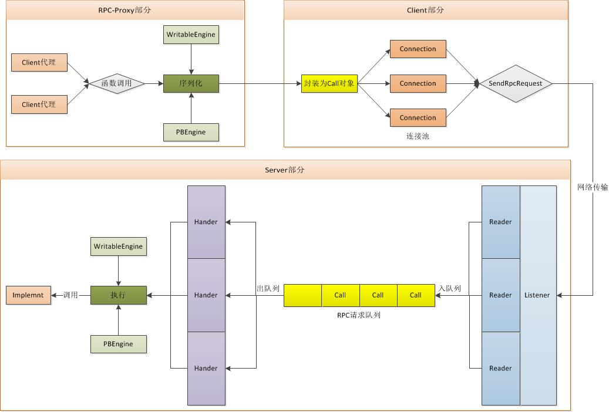

# Hadoop的IPC原理

Hadoop作为一个分布式系统，各个模块进程之间存在各种IPC，即RPC通信，本文将从各个角度对hadoop-common的IPC部分进行分析；

###RPC基础
单进程内部的应用服务service为了保持可扩展性，一般将应用服务service表示为interface和implement两部分，其中服务以interface的方式提供给应用方使用，而将具体的实现以implement的方式进行封装；在未来的应用程序升级过程中，如果interface不变，可以独立的针对implement进行升级；如果需要升级interface，可以采用一定的手段来兼容老的逻辑；

        interface {
            function echo();
        }
        implement {
            function echo() {
                do echo;
            }
        }
        //
        function usage() {
            interface service = new implement();
            service.echo
        }
    
这里我们提到的interface，即为协议，它提供了服务的使用接口和规范（命名规范，参数规范，返回值规范）；

相比单进程的interface和implement，在分布式环境下，implement执行环境与应用运行在不同应用进程中，此时在interface和implement两端都需要一个adpater基于网络来实现服务的远程调用，基本逻辑如下所示：

        interface {
            function echo();
        }
        adapter_client extends interface {
            function echo() {
                connect adapter_server
                send param to adapter_server
                get return from adapter_server
            }
        }
        adapter_server extends interface {
            interface service = new implement();
            function echo() {
                accept adapter_client connect
                service.echo()
                send return to adapter_client
            }
        }
        implement {
            function echo() {
                do echo;
            }
        }
        //
        function usage() {
            interface service = new adapter_client();
            service.echo
        }

这种基于client/server的函数接口调用即为RPC通信，它的核心：首先是需要解决怎么序列化应用函数调用以及参数和返回值，即在adapter_client端怎么把用户一个操作进行序列化，而在adapter_server端怎么把用户一个操作进行反序列化；其次就是实现一个高效的网络通信，来支持这种阻塞的网络请求（为什么阻塞？因为每一个函数的调用都必须“等待”服务端返回结果）

如上所说，Hadoop针对RPC的序列化提供了Writable和PB两种实现方式，并通过org.apache.hadoop.ipc库中Client/Server两个类来实现封装了这种网络通信，后面会具体分析；

###Hadoop IPC中的协议

上面提到，协议即为接口，在hadoop中，协议由两个属性唯一决定：协议名称，协议版本；

在Hadoop中指定协议的名称和版本有两种方式：通过对接口（协议）指定ProtocolInfo的Annotation；通过协议的class.getName来获取protocol的名称以及通过接口static变量来指定versionID；

        //通过ProtocolInfo来明确指定
        @ProtocolInfo(
            protocolName = "org.apache.hadoop.ipc.GenericRefreshProtocol",
            protocolVersion = 1)
        interface HAServiceProtocol {
        }
        //或通过protocal的成员变量versionID来指定
        interface HAServiceProtocol {
            public static final long versionID = 1L;
        }
        //或通过class.getName来获取protocol的名称

在Hadoop中，协议的实现方式有Writable和PB两种，由于PB协议的可扩展性，使得基本上大部分的协议（包括HDFS，YARN）都是基于PB来实现，下面我们来看几个case；

        @ProtocolInfo(protocolName="Foo")
        interface Foo1 extends VersionedProtocol {
            public static final long versionID = 1L;
            String ping() throws IOException;
            String ping2() throws IOException;
        }

这里的Foo1即为一个Writable协议，在client端，对ping/ping2函数的调用都会将协议名称，类型，method名称，参数等都序列化为Writable并发送到server端，在server端完成反序列化以及执行，并将返回值序列化为Writable，被client所解析，并返回给client端；

目前在Hadoop代码中，基本找不到基于Writable的协议了，因为对于Writable协议，我们需要人工的对函数参数和返回值进行人工序列化，对于一些复杂应用场景，比较麻烦（我们上面case的参数为空，返回值为字符串，看不出这种序列化工作带来的麻烦！！，而实际case，那都是相当麻烦的）

        //设计两个数据类型proto和一个service的proto
        message EchoRequestProto {
            required string message = 1;
        }
        message EchoResponseProto {
            required string message = 1;
        }
        service TestProtobufRpcProto {
          rpc echo(EchoRequestProto) returns (EchoResponseProto);
        }
        //虽然这里的两个数据类型的复杂度较低，都只有一个字符串，但是PB对复杂数据类型的序列化支持应该是目前最强大的，所以为了体现PB的强大，我们这里就假设EchoRequestProto和EchoResponseProto内部的数据类型很复杂；
        //service TestProtobufRpcProto“编译”以后，会生成一个BlockingInterface内部接口，它即为我们上面提到的协议interface，在server端，我们可以通过继承它来实现相应的implement，在client端，我们也需要对这个interface做一层包装
        @ProtocolInfo(protocolName = "testProto", protocolVersion = 1)
          public interface TestRpcService
              extends TestProtobufRpcProto.BlockingInterface {
        }
        //为什么要包装？因为TestProtobufRpcProto.BlockingInterface是由PB自动编译生成的，我们不建议直接修改源码来指定协议的protocolName和protocolVersion，因此需要通过继承来指定；
        //其次，好长的名称！
    
到目前为止，我们就通过写proto文件来实现协议的接口，相比Writable，我们可以节约掉手动序列化的过程；

###Hadoop协议与实现的关联

在Client，协议仅仅是一个接口，具体的逻辑都是在调用相应接口的函数时候，调用client_adapter将协议序列化并发布到服务端，而在Server端，我们必须有一点的机制将协议和实现进行关联，在接受到来自client_adapter相应的请求之后，可以将请求“分发”给相应的实现完成计算；

这种关联包括以下几个步骤：

 1. **协议名称与协议类型的关联**
 
上面我们提到类型目前是分为Writable和PB，不同的协议需要不同的协议引擎（RpcEngine）来处理，引擎可以根据协议的不同，使用不同的序列化和反序列对协议进行解析；

        //协议与类型和引擎的关联，即将协议的名称与特定引擎关联，并写到conf中，
        //分为ProtobufRpcEngine和WritableRpcEngine两种
        public static void setProtocolEngine(Configuration conf,
                                Class<?> protocol, Class<?> engine) {
            conf.setClass("rpc.engine."+protocol.getName(), engine, RpcEngine.class);
        }
        //在client_adapter获取到相应协议以后，可以通过getProtocolEngine来获取协议类型以及
        //关联的处理引擎
        public synchronized RpcEngine getProtocolEngine(Class<?> protocol,
                                Configuration conf) {
            RpcEngine engine = PROTOCOL_ENGINES.get(protocol);
            if (engine == null) {
              Class<?> impl = conf.getClass(ENGINE_PROP+"."+protocol.getName(),
                                            WritableRpcEngine.class);
              engine = (RpcEngine)ReflectionUtils.newInstance(impl, conf);
              PROTOCOL_ENGINES.put(protocol, engine);
            }
            return engine;
        }
        
 2. **协议与实现的关联**
 
上面说到，协议可以通过协议类型，协议名称和协议版本进行唯一确定。

        //名称和版本组合为ProtoNameVer类
        static class ProtoNameVer {
            final String protocol;
            final long   version;
        }
        //将协议接口和实现组合为ProtoClassProtoImpl
        static class ProtoClassProtoImpl {
             final Class<?> protocolClass;
             final Object protocolImpl; 
        }
        //并通过registerProtocolAndImpl进行完成关联
        void registerProtocolAndImpl(RpcKind rpcKind, Class<?> protocolClass, 
                    Object protocolImpl) {
             String protocolName = RPC.getProtocolName(protocolClass);
             long version = RPC.getProtocolVersion(protocolClass);
             getProtocolImplMap(rpcKind).put(new ProtoNameVer(protocolName, version),
                    new ProtoClassProtoImpl(protocolClass, protocolImpl)); 
        }
        //
        //协议即为接口，在很多时候，接口存在继承关系，即一个协议的实现，不仅对应一个协议
        //还对应这个协议所有的父协议，在关联的时候，也需要针对父协议一起与协议实现进行关联；
        //关联接口本身
        registerProtocolAndImpl(RPC.RpcKind.RPC_WRITABLE, protocolClass, protocolImpl);
        //获取该接口所有父接口，并一一进行关联
        protocols = RPC.getProtocolInterfaces(protocolClass);
            for (Class<?> p : protocols) {
            if (!p.equals(VersionedProtocol.class)) {
              registerProtocolAndImpl(RPC.RpcKind.RPC_WRITABLE, p, protocolImpl);
            }
        }
        //
        //在接受到一个客户端请求时候，可以从请求的Header部分获取到协议名称和版本，
        //从而获取相应的实现
        private static ProtoClassProtoImpl getProtocolImpl(RPC.Server server,
          String protoName, long clientVersion) throws RpcServerException {
            ProtoNameVer pv = new ProtoNameVer(protoName, clientVersion);
            ProtoClassProtoImpl impl = 
                server.getProtocolImplMap(RPC.RpcKind.RPC_PROTOCOL_BUFFER).get(pv);
            return impl;
        }
    
到目前为止，在一个server端以及关联了一组协议与实现，下面我们会继续分析，client是怎么讲一个rpc请求进行序列化，以及server是怎么进行反序列化，并分发给impl进行处理。
    
###Client的理论基础

在Client，没有服务的任何实现，只需要把RPC请求进行打包，通过网络发送到Server端，因此从实现的角度来说，Client这边只需要提供一个Interface接口，一个服务端ip和端口就可以，其他的任何行为都可以完全封装，与业务无关；Hadoop的RPC也是这样来实现，为业务提供简单的Client接口。

Hadoop采用了动态代理的方式来将Interface和Client网络通信进行关联起来，为了很好理解其中的原理，我们首先来分析一下JAVA中的代理和动态代理相关的基础。

首先，何为代理？简单的理解就是对服务访问的一次包装，包装的目的可能是追加一些前置或后置的判断逻辑，追加相应的日志和操作转换之类的；RPC就是一个典型的代理模式，在单机模式下，我们可以直接访问服务本身，但是在Remote模式下，我们就需要走代理模式，由client-side和server-side两个代理对我们的服务调用转换为网络请求。

其次，何为动态代理？回顾上面的adapter_client和adapter_server，它是一个RPC服务的代理，它有一个很大的缺点，就是针对每一个协议interface都需要去实现一个adapter_client，包括实现interface内部的每一个函数，然而每一个函数的逻辑基本完全一致（序列化，send，receview）；传统的代理模块就会有大量的冗余逻辑，此时动态代理就可以解决这个问题，它通过反射机制，动态的生成接口函数的业务逻辑。

        interface {
            function echo();
            function echo1();
        }
        //
        proxyHandler implements InvocationHandler {
            client c = new client()
            invoke(Object proxy, Method method, Object[] args){ 
                序列化协议，以及method，args
                send to server
                return revice from server
            }
        }
        adapter_interface=(interface)Proxy.newProxyInstance(classLoader,interface
            ,new proxyHandler()); 
        adapter_interface.echo()
        adapter_interface.echo1()
        
在上面的proxyHandler，我们将adapter_client和adapter_server之间的交互逻辑进行完美封装，最后通过Proxy.newProxyInstance获取一个代理对象，我们就可以直接调用代理对象上所代理的函数；

Hadoop的RPC的实现差不多就是这个了，下面注解一部分核心代码

        //和上面的一样，通过Proxy.newProxyInstance获取一个protocol的代理对象
        //这里提供的InvocationHandler为一个Invoker对象，它接受一个InetSocketAddress参数
        //用于在Invoker内部维持一个与服务端的网络连接（即client对象）
        public <T> ProtocolProxy<T> getProxy().echo()(Class<T> protocol, long clientVersion,
                         InetSocketAddress addr, UserGroupInformation ticket,
                         Configuration conf, SocketFactory factory,
                         int rpcTimeout, RetryPolicy connectionRetryPolicy,
                         AtomicBoolean fallbackToSimpleAuth) {    
            T proxy = (T) Proxy.newProxyInstance(protocol.getClassLoader(),
                new Class[] { protocol }, new Invoker(protocol, addr, ticket, conf,
                    factory, rpcTimeout, fallbackToSimpleAuth));
            return new ProtocolProxy<T>(protocol, proxy, true);
        }
        //Invoker内部维持一个与服务端的连接：client
        //同时将代理对象的函数和参数封装为一个Invocation对象
        //该对象就负责对协议调用的的序列化
        class Invoker implements RpcInvocationHandler {
            private Client client;//服务端连接
            public Object invoke(Object proxy, Method method, Object[] args) {
                value = client.call(RPC.RpcKind.RPC_WRITABLE, new Invocation(method, args),
                        remoteId, fallbackToSimpleAuth);
                return value
            }
        }

通过上面的整个流程，实现Interface协议的一个动态代理，通过代理，我们就直接调用Interface协议内部提供的功能函数,如：getProxy().echo()

###Server的理论基础

相比Client端使用到一个动态代理这样的东西来优化RPC的实现，Server端的实现就更多比较体现在网络通信这边，属于实践上的东西更多，

在Server端接收到一个来自Client的RPC请求，Server通过头部获取到协议的名称，版本，通过协议体获取到具体调用的函数，通过上面说到的协议与实现的关联获取到实例对象，调用并返回执行结果。

在hadoop运维过程中，也经常遇到Server这边的默认参数留的坑，对Server的了解还是很有必要，下面章节，我们就会针对Client/Server网络通信上的东西进行详细分析；

###Client/Server网络通信

上图为Hadoop的RPC请求（不过返回）的整个过程；

**RPCEngine**

如上所言，目前Hadoop支持Writable和PB两种类型的协议的类型，也分别实现了两种引擎：WritableEngine和PBEngine，两种不同的引擎主要完成的工作有两种：负责完成RPC的序列化和处理相应的RPC；

下面我们拿WritableEngine，来详细说一下：

        //首先是序列化，它负责将协议类型，Method，parameters序列化为一个Writable对象
        //从这么我们可以看出基于Writable的RPC是将"协议版本"，"协议名称"，"方法名称"
        //"客户端版本"，"函数签名"，"参数个数"，以及"参数"全部序列并发送出去；
        class Invocation implements Writable {
            //根据method和参数构造一个Invocation对象
            public Invocation(Method method, Object[] parameters) {
            }
            public void write(DataOutput out) throws IOException {
                  out.writeLong(rpcVersion);
                  UTF8.writeString(out, declaringClassProtocolName);
                  UTF8.writeString(out, methodName);
                  out.writeLong(clientVersion);
                  out.writeInt(clientMethodsHash);
                  out.writeInt(parameterClasses.length);
                  for (int i = 0; i < parameterClasses.length; i++) {
                    ObjectWritable.writeObject(out, parameters[i], parameterClasses[i],
                                               conf, true);
                  }
            }
        }
        //其次处理相应的RPC，Server端的Handle线程获取到序列化后的对象
        //调用相应Engine的RpcInvoker实现的call函数，
        //在call完成Invocation对象的反序列化，获取关联的implement，并执行相应的函数
        static class WritableRpcInvoker implements RpcInvoker {
            public Writable call(Server server,
                String protocolName, Writable rpcRequest, long receivedTime){
                //反序列化
                Invocation call = (Invocation)rpcRequest;
                //根据协议名称/版本，获取相应的实现implement
                final String protoName = call.declaringClassProtocolName;
                ProtoClassProtoImpl protocolImpl;
                ProtoNameVer pv = 
                    new ProtoNameVer(call.declaringClassProtocolName, clientVersion);
                ProtoClassProtoImpl protocolImpl = 
                    server.getProtocolImplMap(RPC.RpcKind.RPC_WRITABLE).get(pv);
                //调用相应的method
                Method method =protocolImpl.protocolClass.getMethod(call.getMethodName(),
                        call.getParameterClasses());
                Object value = 
                    method.invoke(protocolImpl.protocolImpl, call.getParameters());
                return value
            }
        }

**Client端的网络通信**

反向代理中的invoke函数最后将用户的操作序列化为一个Invocation对象，并调用client.call函数完成RPC请求的网络通信

        public class Client {
            public Writable call(rpcRequest, remoteId){
                //将类型为Invocation的rpcRequest对象封装为一个call对象
                final Call call = createCall(rpcKind, rpcRequest);
                //通过remoteId获取一个与服务端的网络连接
                Connection connection = getConnection(remoteId, call);
                //发送网络请求
                connection.sendRpcRequest(call);
                //监控call的状态是否完成
                synchronized (call) {
                    while (!call.done) {
                        call.wait();
                    }
                    if (call.error != null) {
                        throw call.error;
                    } else {
                        return call.getRpcResponse();
                    }
                }
            }
        }

对应Connection和sendRpcRequest内部的细节就不细说了，原理很简单，可优化区间不大，仅仅是一个网络通信的过程；

**Server端的网络通信**