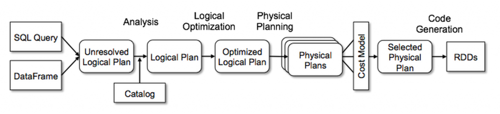
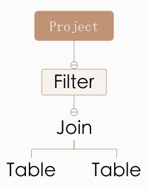

# Spark Catalyst的实现分析

Spark SQL是Spark内部最核心以及社区最为活跃的组件，也是未来Spark对End-User最好的接口，支持SQL语句和类RDD的Dataset/DataFrame接口。相比在传统的RDD上进行开发，Spark SQL的业务逻辑在执行前和执行过程中都有相应的优化工具对其进行自动优化(即Spark Catalyst以及Tungsten两个组件)，因此未来Spark SQL肯定是主流。

在Spark SQL发展早期，其实我个人是很排斥Spark SQL，在我看来，裸用RDD，可以最大程度上满足我的`控制欲`，但是随着Spark的发展，也逐渐显示个人思维的短见（Spark是满足广大业务团队对数据分析的需求，最简单，最自动化优化的接口肯定是最易被人接受和吹捧的）；我排斥Spark SQL另外一个原因就是我Scala还不够精通，在以前版本中，Spark对SQL语句的解析并生成AST树，是使用Scala内部的`scala.util.parsing`来实现，那代码的苦涩难懂，是无法用语言来描述的，而且AST树是对SQL优化以及执行的过程理解的入口，因此只能望而却步了！在Spark 2.0以后，引入ANTLR来进行AST树的解析，让一切变都清晰，因此也就开始有了我下面的学习的工作了，丷丷！！

Spark SQL和Catalyst分别对应了SQL执行期以及解析期的优化工作，因此Catalyst的理解是Spark SQL的第一步。在一些Catalyst的介绍以及讲座中，下面一张图是必出现，它描述了从SQL语句到最后执行Plan的生成过程中，除了Spark SQL，其他SQL引擎的工作原理也基本一致，比如Hive之类的。

本文核心也是介绍Catalyst内部的实现，但是不是按照这张图的步骤来介绍Catalyst的实现原理，而是按照SQL给人最直接几个概念，比如Row，Expression，Plan来逐步介绍它们的内部实现。

看过Spark SQL或者Catalyst人都知道，相比Spark Core的代码，这一块真的挺复杂了，各种算法逻辑，复杂的Scala语法元素，以及各种性能优化，代码自动生成，可能得需要几倍的时间，反复的琢磨，才能梳理清楚。

##1. Row

Spark SQL中处理的数据与传统RDD最大区别在处理的每行数据的类型表示，传统RDD不对每行数据进行类型要求，可以任何复杂数据结构，比如Map之类的，而Spark SQL中为`Row`。`Row`的概念是针对之前版本中的DataFrame而言的，在1.6版本中提出的Dataset其实也是有`Row`的概念，只是会被隐式转换掉而已，在Catalyst中，处理的对象为`InternalRow`，注意`InternalRow`和`Row`是有本质区别的，`Row`是API层面的概念，专门针对DataFrame，而`InternalRow`为内部概念。

`Row`类为DataFrame中核心概念，它表示一行结构化数据的输入，`Row`本身可以有Scheme，即支持设置每个字段的类型，支持GetInt之类的操作；它也可以无Scheme，即`Scheme=NULL`，支持泛化的Get操作，返回Any类型数据。`Row`本身就有点像`Array，Tuple`,它的子类`GenericRow`和`GenericRowWithSchema`都是基于`Array[Any]`来实现，它的每个字段的类型为`Any`，因此`Row`可以理解为是无类型约束的，虽然它内部有`Scheme`，但是`Array[Any]`到`Row`的转换，以及泛化的Get操作都是不受Scheme的限制，因此它是类型不安全的。

在Spark 1.6版本以后，提出了Dataset概念，它也是Spark从RDD，SchemeRDD，DataFrame演化过来最为标准化一个概念，相信在未来会是Spark中最为核心概念，`In the long run, we expect Datasets to become a powerful way to write more efficient Spark applications.`

Dataset是Spark SQL中概念，在API层面上来说，它没有像DataFrame一样，强制要求输入数据为`Row`，或者依赖`Row.fromSeq`等功能函数将输入其他类型的数据强制转换为Row，但是Dataset实际也是要求它处理的数据是`Row相似的类型`，即为Catalyst内部的`InternalRow`和`UnsafeRow`的概念。当我们执行`seq(1,2,3).toDs或者Rdd.toDs`时候，实际上对每一行记录在内部做了很多转换。DataFrame也被转换为Dataset进行包装，即将DataFame表示为`Dataset[Row]`。

Dataset核心概念是为`Encoder`，它就是我们上面说隐式转换的幕后工具，如下所示Encoder内部的toRow函数，支持将输入T类型转换为`InternalRow`：

	def toRow(t: T): InternalRow = try {
	    inputRow(0) = t
	    extractProjection(inputRow)
	}

它支持将一个外部的数据类型，转换为Dataset内部的`InternalRow`，比如上面的`seq(1,2,3)`就是需要将每个输入的Int数字转换为一个`InternalRow`，`DataFrame`同理需要将`Row`转换为`InternalRow`。在转换的过程中，是有类型的检查，这也是与DataFrame最大的区别。

另外Dataset对外最为自豪一点就是序列化以及反序列化的性能，用官方话说:`Datasets also leverage Tungsten’s fast in-memory encoding，an order of magnitude faster than the default Java serializer`，那么它是这么实现呢？其实他就是上面谈到的`Encoder`的功能，上面虽然我们说它返回的是一个`InternalRow`，实际上，它返回的是`InternalRow`一个子类，即`UnsafeRow`，`UnsafeRow`内部是基于Java的unsafe包来实现（Tungsten的功能），对Row中每个字段的操作都转换为字节的操作，换句话说它底层实际存储结构是byte[]，而且支持Kryo序列化，相比使用Java序列化工具来序列化数组/Row之类的复杂数据结构，它的性能肯定要好很多！

另外`InternalRow`还有一个子类，即`MutableRow`，而且`UnsafeRow`也是`MutableRow`的子类，它即为可修改的`InternalRow`，在很多地方都会出现这个，原理很简单，支持set等操作而已。

##2. Expression

在SQL语句中，除了SELECT FROM等关键字以外，其他大部分元素都可以理解为Expression，比如`SELECT sum(a), a`，其中`sum(a)`和`a`都为Expression；
- Expression是一个Tree结构，即可以通过多级的Child Expression来组合成复杂的Expression，比如前面`sum(a)`就是由`sum` 和`a` 两个简单的Expression组合而成，比如更复杂的Expression有`max(sum(a),sum(b))`;
- Expression基本的功能是求值，比如`abs(a)`，`IfNull(A,B)`之类的操作，他们都是对输入Row进行加工，并输出处理结果，即Expression需要实现`def eval(input: InternalRow = null): Any`函数来实现它的功能。
- 既然Expression的功能是求值，那么它就有输入和输出类型的限制。每个Expression都有`def dataType: DataType`类型变量来表示它的输出类型，以及`def checkInputDataTypes(): TypeCheckResult`函数来校验当前Expression的输入（为Tree结构，那么它的输入即为Child Expression输出）是否符合类型要求。
- Expression功能是针对Row进行加工，但是可以把加工方法分为以下几种
	- 原生的`def eval(input: InternalRow = null): Any`函数；
	- 对于Non Child Expression，Expression的计算是基于Child Expression计算结果进行二次加工的，因此对于Non Child Expression，对Eval进行默认实现，子类只需要实现函数`def nullSafeEval(input: Any): Any`即可以，如下所示为只有一个Child的Expression的实现：

			override def eval(input: InternalRow): Any = {
				val value = child.eval(input)
				if (value == null) {
					null
				} else {
					nullSafeEval(value)
				}
			}
			//比如ExpressionAbs，就是利用子Expression的结果结果之上，进行一个math.abs加工。

	- Expression也可能是不支持eval的，即`Unevaluable`类型的Expression，一般有三种情况：1)是真的无法求值，比如处于Unresolved状态的Expression；2)是不支持通过eval进行求值，而需要通过gencode的方式来实现Expression功能;3)Expression为`RuntimeReplaceable`类型，它仅仅是在parser阶段一种临时Expression，在优化阶段，会被替换为别的Expression，因此它本身不需要有执行逻辑，但是得有替换相关的逻辑。
	-  `Projection`类型，它本身不是Expression，但是它可以根据N个Expression，对输入row的N个字段分别进行加工，输出一个新的Row，即Expression的容器。

			abstract class Projection extends (InternalRow => InternalRow)
			def apply(input: InternalRow): InternalRow = {
			    val outputArray = new Array(exprArray.length)
			    var i = 0
			    while (i < exprArray.length) {
			      outputArray(i) = exprArray(i).eval(input)
			      i += 1
			    }
			    new GenericInternalRow(outputArray)
			  }
			//比如row序列化操作，可以把一个row序列化为unsaferow，相当与一个Projection

对Package下的Expression进行一个大体的归类，如下所示：
| Name      |归类|    功能描述 |
| :-------- |---| --------|
| 数据输入：  ||Expression为Tree结构，中间节点都为加工类型表单，而叶子节点即为数据产生节点|
|Attribute||Catalyst里面最为重要的概念，可以理解为表的属性，在sql处理各个阶段会有不同的形态，比如UnresolvedAttribute->AttributeReference->BoundReference，后面会具体分析|
|Literal||常量，支持各种类型的常量输入|
|datetimeExpressions||返回当前时间类型的常量，`CurrentDate`,`CurrentTimestamp`|
|randomExpressions||支持生成一些随机数|
|其他一些输入||比如获取sql计算过程中的任务对应的InputFileName，SparkPartitionID|
| 基本计算功能：  |||
| arithmetic |nullSafeEval |数学Expression，支持`-`,`+`,`abs`, `+`,`-`,`*`,`/`,`%`,`max`,`min`,`pmod`数学运算符|
|bitwiseExpressions|nullSafeEval|位运算数，支持IntegralType类型的`and`,`or`,`not`,`xor`位运算|
|mathExpressions|nullSafeEval|数学函数，支持`cos`,`Sqrt`之类30多种,相当于Math包|
|stringExpressions|nullSafeEval|字符串函数，支持`Substring`,`Length`之类30多种，相当于String包|
|decimalExpressions|nullSafeEval|Decimal类型的支持，支持`Unscaled`,`MakeDecimal`操作|
|datetimeExpressions|nullSafeEval|时间类型的运算|
|collectionOperations|nullSafeEval|容器的操作，支持容器`Contains`,`Sort`,`Size`三种操作|
|cast|nullSafeEval|支持数据类型的转换|
|misc|nullSafeEval|功能函数包，支持MD5，crc32之类的函数功能|
| 基本逻辑计算功能：  |||
| predicates  |eval/nullSafeEval类型|支持子Expression之间的逻辑运算，比如`AND`,`In`,`Or`，输出Bool类型|
|regexpExpressions|nullSafeEval|支持LIKE相关操作|
|conditionalExpressions|eval|支持case，if，great，least四种逻辑判断运算|
|nullExpressions|eval/RuntimeReplaceable|与NULL/NA相关的判断或者IF判断功能，大部分都为RuntimeReplaceable，会被进行优化处理|
| 其他类型：  |||
|complexTypeCreator|eval|SparkSql是支持复杂数据结构，比如Array，Map，Struct，这类Expression支持在sql语句上生成它们，比如select array|
|Generator|eval|支持flatmap类似的操作，即将Row转变为多个Row，支持Explode和自定义UserDefinedGenerator两种，其中Explode支持将数组和map拆开为多个Row。|

###2.1 Attribute详解
Attribute直译为属性，在SQL中，可以简单理解为输入的Table中的字段，Attribute通过Name字段来进行命名。SQL语句通过Parse生成AST以后，SQL语句中的每个字段都会解析为UnresolvedAttribute，它是属于Attribute的一个子类，比如`SELECT a`中的`a`就表示为`UnresolvedAttribute("a")`，还有一个特殊的UnresolvedAttribute，既为SQL语句中的`＊`，它表示为`Star`，属于UnresolvedAttribute类型的子类。

Analy需要对AST进行进一步的加工，其中有一个很重要的操作就是把整个AST中所有Unresolved的Attribute都转变为resolved状态，比如根据输入Table将Star进行expand操作，对应的`Rule`名称为`ResolveReferences`，具体实现细节这里就不展开。

对于resolve操作除了将Star进行展开以外，它的主要功能就是关联SQL语句所有位置用到的Attribute，即在Attribute的name基础上，指定一个ID进行唯一标示，如果一个Attribute在两处被多处被引用，ID即为同一个(怎么实现的？Attribute Resolve操作时从底到顶来遍历整改AST，每一步都是根据底部已经resloved的Attribute来给顶部的Attribute赋值，从而保证如果两个Attribute是指向同一个，它们的ID肯定是一样的；对于处于叶子节点Attribute是优先进行resolve的，比如`Rule:ResolveRelations`对处于底部的Relation进行ResolveRelatition)。可以这么理解，做这些事情都是为了优化，物理存储的Table可能有很多Attribute，而通过resolve操作，就指定整个计算过程中需要使用到Attribute，即可以只从物理存储中读取相应字段，上层各种Expression对这些字段都转变为引用，因此resolve以后的Attribute不是叫做`resolvedAttribute`,而是叫做`AttributeReference`。

对于一个中间节点的Expression，如果它对一个Attribute有引用，比如求一个字段值的长度`length(a)`，这里`a`经过了UnresolvedAttribute到AttributeReference的转化，但是针对一个输入的Row，进行`length`Expression计算时，还是无法从`AttributeReference`中读取相应在Row中的值，为什么？虽然`AttributeReference`也是Expression，但是它是Unevaluable，为了获取属性在输入Row中对应的值，需要对`AttributeReference`再进行一次`BindReferences`的转化，生成`BoundReference`，这个操作本质就是将Expression和一个输入Scheme进行关联，Scheme由一组`AttributeReference`，它们之间是有顺序的，通过获取AttributeReference在`AttributeReference`组中的Index，并生成BoundReference，在对BoundReference进行eval时候，即可以使用该index获取它在相应Row中的值。

下面是SQL语句中Attribute经过的多次转化的过程：

	SQL---parser---->UnresolvedAttribute----Analyser--->resolvedAttribute ----Bind---->BoundReference

###2.2 Expression Codegen
Spark Sql是支持Expression层面代码生成，首先第一个疑问是我们知道Expression有eval方法来暴露Expression的功能，为什么还要搞一个Codegen呢？原因大体上有两个，一是提高性能，二是支持一些不能通过eval来表达的功能。这里主要解释了第一个，即提高性能，ps：我还没有去详细的测试这一块对性能影响大小，只是从感官上做一个结论：

基于eval，Expression执行过程中应该是这样的e1.eval(e2.eval(e3.eval(e4.eval(...))))，随着Expression的复杂度上升，这个执行深度应该会很大，而且每一个操作之间是基于参数和返回进行传递，在操作系统系统层面是存在开销的；其次如果一个Expression计算结果会被多次利用，它的结果是没有办法被二次利用。

那么代码生成是这么解决这个问题的呢？

对于一个完整的SQL的执行，其中所有Expression只是对应一个最终执行代码的一个片段，注意是代码片段，而不是函数，更加不是一个类，每个代码片段由ExprCode来表示

	case class ExprCode(var code: String, var isNull: String, var value: String)

code为代码片段的计算代码，和eval函数功能一样，这个片段核心功能是对一个row进行处理，并把处理结果的值写到一个变量中，这个变量名称即为value表示，isNull为false或者true字符串来表示这个代码片段生成的value对应的值是否为Null。

	如果由3个Expression，分别为
	exp1:ExprCode(code1，isnull1，value1)
	exp2:ExprCode(code2，isNull2，value2)
	exp2:ExprCode(code3，isNull3，value3)
	在SQL执行过程中，针对一个Row会生成下面的组合代码
	funtion(row) {
		//定义三个变量
		exp1.dataType value1 = defauleValue(exp1.dataType)
		exp2.dataType value2 = defauleValue(exp1.dataType)
		exp3.dataType value3 = defauleValue(exp1.dataType)
		//
		exp1.code1
		exp2.code2//可以使用value1变量的值
		exp3.code3//可以使用value1和value2的值
		....
	}

Expression层面的Codegen的实现其实很简单，这里就是不详细去描述，后面会重新针对codegen，包括Whole Stage Codegen一起做一次大大专题进行分析。

##3. LogicalPlan
如上所言，在SQL语句中，除了SELECT FROM等关键字以外，其他大部分元素都可以理解为Expression，那么用什么来表示剩下的SELECT FROM这些关键字呢？毕竟Expression只是一些Eval功能函数或者代码片段，需要一个东西来串联这些片段，这个东西就是`Plan`，注意，我这里说的是`Plan`，是一个统称，而不是仅指向`LogicalPlan`。如开言图所示，在SQL解析以及优化，到最后过程中，都是以`Plan`而存在，只是每一步`Plan`功能不同而已。

`Plan`表现形式也是Tree，节点之间的关系可以理解为一种操作次序，比如Plan叶子节点表示从磁盘读取DB文件，而Root节点表示最终数据的输出；下面是`Plan`最常见的实例截图。

用SQL语句来表示这个Plan即为:`SELECT project FROM table, table WHERE filter`。

Expression功能是对输入Row进行加工，输出可能是Any数据类型。而Plan输出类型为`def output: Seq[Attribute]`表示的一组Attribute，比如上面的`Project`和`Table`肯定是输出一个由`Seq[Attribute]`类型表示的Row，`Filter`感觉是输出Ture/False，但是这里说的Plan，而不是Filter类型的Expreesion，Filter类型的Plan会在内部根据Expression计算结果来判断是否返回Row，但是Row返回的类型肯定也是由`Seq[Attribute]`表示的。

另外Expression与Plan关系是被包含，比如`Filter`肯定是基于一个`Expression`计算结果进行判断，`Project`内部元素要么是直接为`Star`，或者为`Attribute`，或者为复杂的`Expression`，比如`SUM`。

下面我开始分析`LogicalPlan`，它是SQL语句经过Parse以后第一步展现形式。基于ANTLR实现的SQL AST分析过程即为AST树遍历过程，Catalyst也是对AST树遍历过程中，完成LogicalPlan和所有依赖的Expression的构建，相关逻辑在`org.apache.spark.sql.catalyst.parser.AstBuilder`以及相关子类中，如果对ANTLR有一点基础，这一块代码还是比较容易看懂，就不细化分析，我们着重放在LogicalPlan上面。

在上面示意图中，我们看到`LogicalPlan`是由一些节点组成，在Spark SQL中，节点大体分为两种类型：Operator和Command。其中我们上面看到的`Filter`都可以理解为Operator，而我们在SQL Cli中执行`set a=b`以及`addjar a`,它们都是Command类型的Plan，当然相比由很多Operator组成的多级复杂Plan，Command组成的Plan可能是单节点而存在，要简单一些，下面我们对Operator做一些归类。

| Name      |   功能描述 |
| :-------- | --------|
|`Project`(projectList: Seq[NamedExpression], child: LogicalPlan)|SELECT语句输出操作，其中projectList为输出对象，每一个都为一个Expression，它们可能是Star，或者很复杂的Expression|
|`Filter`(condition: Expression, child: LogicalPlan)|根据condition来对Child输入的Rows进行过滤|
|`Join`(left: LogicalPlan,right: LogicalPlan,joinType: JoinType,condition: Option[Expression])|left和right的输出结果进行join操作|
|`Intersect`(left: LogicalPlan, right: LogicalPlan)|left和right两个Plan输出的rows进行取交集运算。|
|`Except`(left: LogicalPlan, right: LogicalPlan)|在left计算结果中剔除掉right中的计算结果|
|`Union`(children: Seq[LogicalPlan])|将一组Childs的计算结果进行Union联合|
|`Sort`(order: Seq[SortOrder],global: Boolean, child: LogicalPlan)|对child的输出进行sort排序|
|`Repartition`(numPartitions: Int, shuffle: Boolean, child: LogicalPlan)|对child输出的数据进行重新分区操作|
|`InsertIntoTable`(table: LogicalPlan,child: LogicalPlan,...)|将child输出的rows输出到table中|
|`Distinct`(child: LogicalPlan)|对child输出的rows取重操作|
|`GlobalLimit`(limitExpr: Expression, child: LogicalPlan)|对Child输出的数据进行Limit限制|
|`Sample`(child: LogicalPlan,....)|根据一些参数，从child输出的Rows进行一定比例的取样|
|`Aggregate`(groupingExpressions: Seq[Expression],aggregateExpressions: Seq[NamedExpression],child: LogicalPlan)|对child输出row进行aggregate操作，比如groupby之类的操作|

这些Operator共同组成SELECT SQL语句中各种核心语言要素，而且Catatyst后面的所有优化逻辑都是针对SELECT语句进行优化。对于譬如CREATE TABLE以及SET之类的SQL语言元素，它们都是Command存在，相比SELECT，Command组成的Plan要简单很多，不过它的种类倒是真的不少！

| Name      |   功能描述 |
| :-------- | --------|
|`DataBase`操作类|支持ShowDatabase以及UseDatabase以及Create等操作|
|`Table`操作类|多达13种，比如Create，Show，Alter等|
|`View`操作类|CreateViewCommand支持View的创建|
|`Partition`操作类|支持Partition新增删除等操作|
|`Resources`操作类|比如AddJar之类的资源操作|
|`Functions`操作类|支持新增函数，删除函数等操作|
|`Cache`操作类|支持对Table进行cache和uncache操作|
|`Set`操作|通过SetCommand执行对参数进行临时修改|

由Operator组成的Plan，仅仅只是一组描述形式的而存在，毕竟只是`LogicalPlan`，它们需要被转换为最终的`PhysicalPlan`才能真正具有可执行的能力，而这些Command类型的Plan都是以`def run(sparkSession: SparkSession): Seq[Row]`函数暴露给Spark SQL，比如通过调用Table的run函数完成Table的创建等操作。因此我们可以肯定的是：Plan优化都是针对以Operator组成的Plan。

##4. Expression和Plan的Tree支持的操作

在Catalyst中，Expression和Plan都为Tree类型的数据结构，无论是从SQL语句中解析出Plan或者Expression，或针对Plan或Expression进行Analy以及Optimize操作，都需要针对Tree数据结构进行遍历，其中经典Tree遍历算法有先序和后序遍历。

另外由于TreeNode节点本身类型为`Product`（何为`Product`？在Scala中`Product`是最基本数据类型之一，如果一个`Case Class` 继承`Product`，那么即可以通过`productElement`函数或者`productIterator`迭代器对`Case Class`的参数信息进行索引和遍历），并且所有Expression和Plan都是属于`Product`类型，因此可以通过TreeNode内部定义的`mapProductIterator`函数对节点参数进行遍历。在遍历过程中，可以针对参数类型进行Case过滤，从而有选择的处理本次希望处理的数据，比如对一个Expression中所有类型为Expression的子表达式进行操作，而可以忽略其他类型的参数。

对Plan或Expression进行遍历的目的：首先是为了收集一些信息，比如针对Tree进行map/foreach操作；其次是为了对Tree节点内部的信息进行修改，比如对PlanTree中每个Plan节点内部引用的Attribute进行Revole操作；最后就是为对Tree的数据结构进行修改，比如删除Tree的子节点，以及与子节点进行合并，比如Catasylt Optitimze就有大量Tree结构的修改。

Catalyst在实现Tree的操作上，代码很是优雅的主要原因：它是基于Scala来实现。Scala的偏函数PartialFunction（偏函数是对函数定义域的一个子集进行定义的函数。 scala中用scala.PartialFunction[-T, +S]类来表示）可以清晰的描述操作目的，比如`PartialFunction[LogicalPlan, LogicalPlan]`是针对Plan类型的节点进行操作，而`PartialFunction[Expression, Expression]`是针对Expression进行操作；其次Scala强大的Case正则匹配，让在对Tree进行遍历过程，可以清晰确定这一次需要操作的对象，如果用别的语言来实现下面TypeFilter合并，其代码将会是何等的苦涩。

	case t1 @ TypedFilter(_, _, t2 @ TypedFilter(_, _, child))
		if t1.deserializer.dataType == t2.deserializer.dataType =>
		TypedFilter(combineFilterFunction(t2.func, t1.func), t1.deserializer, child)
	//优雅Case结构匹配语句，以及简洁的CaseIF判断，让快速定位相应的逻辑节点，并对节点数据进行修改变的如此简单。

同时无论是对Expression进行操作还是对Plan进行操作，Catalyst将他们都抽象为`Rule`，它的apply函数通过传入一个TreeType类型的元素，并输出一个TreeType类型的元素。

	abstract class Rule[TreeType <: TreeNode[_]] extends Logging {
	  val ruleName: String
	  def apply(plan: TreeType): TreeType
	}

在对一个元素进行`rule.apply`操作以后，可以针对前后的元素是否相等`curPlan.fastEquals(lastPlan)`，来确定该`rule`是否对该元素有效，其中无效可能是因为该rule没有case匹配到相应信息，首先可能是真的没有，其次`rule`是可以反复的应用到一个节点，直到节点状态趋向稳定，即`rule`已经应用多次，已经找不到匹配的信息了。

另外可以将一组`Rule`组合为一个`Batch(name: String,rules: Rule[TreeType]*)`并把它封装在`RuleExecutor`中，从而通过`RuleExecutor`将该组`Rule`的可执行接口提供给外部使用，比如大名顶顶的Optimize策略，就是一堆堆的Batch组成。

	abstract class Optimizerextends RuleExecutor[LogicalPlan] {
		def batches: Seq[Batch] = {
			Batch("Finish Analysis", Once,
			EliminateSubqueryAliases,
			ReplaceExpressions,
			ComputeCurrentTime,
			GetCurrentDatabase(sessionCatalog),
			RewriteDistinctAggregates) ::
		....

如上所言，`Rule`是通过反复的应用在一个节点，直到节点状态趋向稳定。但是如优化类型的`Rule`，很多时候，优化是没有止境了，优化的越深，优化开销就越大。因此我也需要一定的手段来控制`Batch`应用到何种程度，比如`Once extends Strategy`表示该`Batch`只允许应用一次；而`FixedPoint extends Strategy`表示该`Batch`最多只允许应用N次，当然如果`batch`在运行过程中，节点已经`稳定`，会立即退出尝试的。

Spark SQL对Plan Tree或者内部Expression Tree的遍历分为几个阶段：对AST进行Parse操作，生成UnresolvePlan；对UnresolvePlan进行Analy(包括Resolve)操作，生成Logical Plan；对Logical Plan进行Optimize操作，生成Optimized LogicalPlan；以及最后进行Planning操作，生成PhysicalPlan。这里面的每一阶段都可以简述为应用一组BatchRule来对plan进行加工，但是里面每一个Rule都是很值得去细节学习和分析的，实话，我也没有一个一个去看！！！

> 本文主要是针对catalyst内部实现做了一些简洁的分析，注重分析与catalyst相关的三个概念`Row，Expression，Plan`，因为对三个概念的理解与否，将决定是否可以看懂spark sql后面相关细节。
> 同时，Spark SQL真的很复杂，如果想真的完全理解Spark SQL内部的具体细节，这条路还是很长！fighting！
